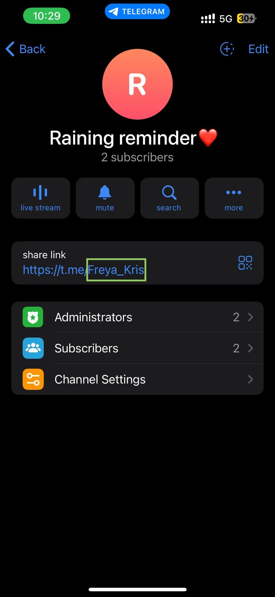

# What is Raining-Reminder-Python-Automation-Script?
This Python script automates daily rain notifications via Telegram. At 7 AM, it fetches weather data, identifies rain periods, and sends a message to a Telegram channel. Features include automated weather retrieval, rain period detection, and message management to avoid duplicates. Stay prepared for rainy days!
# Inspiration -- Why I started this project?
I started this project because, let's face it, my main reason for checking the weather app is to see if it's going to **rain today** so I know whether to bring an umbrella or not. But for most weather apps(Apple Weather ahaha), I have to wade through a flood of information I don't care about—air quality, wind direction, and a week's worth of forecasts. Honestly, I'm too lazy to do this every day, and I often forget, which means I end up getting soaked in surprise rain showers.😢

So, I thought, why not automate the process? Using a Python script, I can extract the most important info for me—today's rain periods—and get a notification every morning before I leave home. This way, I get a handy reminder to grab my umbrella without drowning in irrelevant details. Problem solved, and I stay dry!

# Getting today's weather forecast

https://www.weatherapi.com/

# Set up a messenger to receive notifications

I used Telegram to receive notifications. I created a bot that will send messages on telegram using BotFather. I also created a public channel and invited my bot into this channel to send weahter notifications for me. 

This is the channel that I've created. In this case, the channel name is Freya_Kris. The text at the top ("Raining Reminder") is just for display purposes. To address my channel from Python, we need to use @Freya_Kris as a channel name.

# Script Parameters
At the beginning of main function, I have declared five variables. The first one is city, this variable is used to locate the city for weather forecast. It will be included in the API URL call. The second one is api, this is the api key from my weather.api account. BOT_API_KEY is the key I've got during the Telegram bot set up. CHANNEL_NAME is the name of the public channel I've created with @ at the beginning. In my case, it's @Freya_Kris.

# How the script works
requests.get(url, params=parameters) in the Get_Weather() function is the call to weatherapi. Then we get 24 pieces of hourly description of the weather forecast for the current day from 00:00 to 23:00. It will contain the word "rain", "shower" or "drizzle" if it's expected to rain. So we loop through the 24 pieces of hourly description(00:00-00:06 will be passed since I definitly will be outside that time ahahahah), if we find the indicated words for a certain clock(ex:07:00),  this clock (ex:07:00) will be included in the raining period. After we detected all the raining period - we make a request to the Telegram API asking to send a message indicating the raining period from our bot. That's it!

# Scheduling the script to run daily
