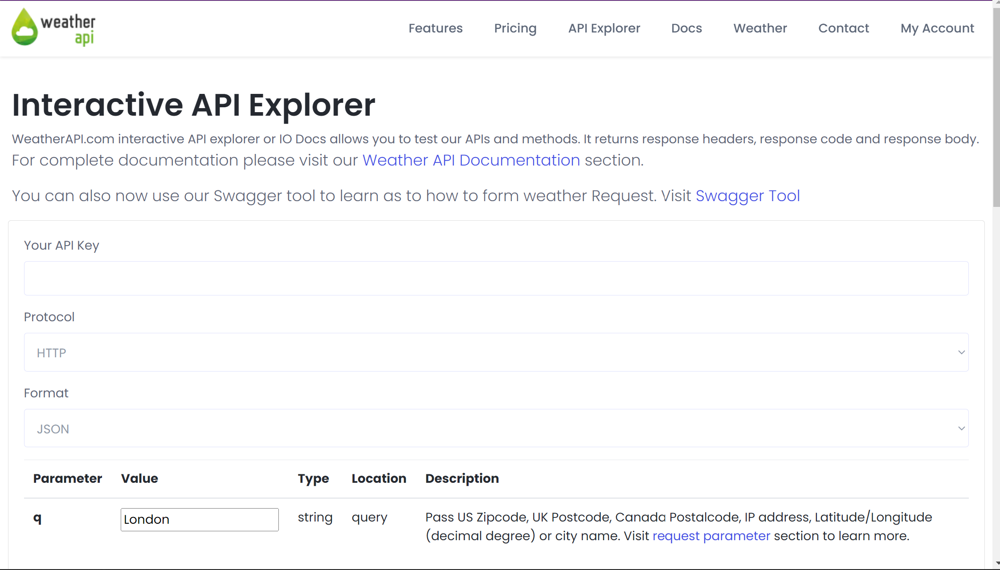

# What is Raining-Reminder-Python-Automation-Script?
This Python script automates daily rain notifications via Telegram. At 7 AM, it fetches weather data, identifies rain periods, and sends a message to a Telegram channel. Features include automated weather retrieval, rain period detection, and message management to avoid duplicates. Stay prepared for rainy days!
# Inspiration -- Why I started this project?
I started this project because, let's face it, my main reason for checking the weather app is to see if it's going to **rain today** so I know whether to bring an umbrella or not. But for most weather apps(Apple Weather ahaha), I have to wade through a flood of information I don't care about—air quality, wind direction, and a week's worth of forecasts. Honestly, I'm too lazy to do this every day, and I often forget, which means I end up getting soaked in surprise rain showers.😢

So, I thought, why not automate the process? Using a Python script, I can extract the most important info for me—today's rain periods—and get a notification every morning before I leave home. This way, I get a handy reminder to grab my umbrella without drowning in irrelevant details. Problem solved, and I stay dry!

# Getting today's weather forecast

https://www.weatherapi.com/

# Set up a messenger to receive notifications

I used Telegram to receive notifications. I created a bot that will send messages on telegram using BotFather. I also created a public channel and invited my bot into this channel to send weahter notifications for me. 

